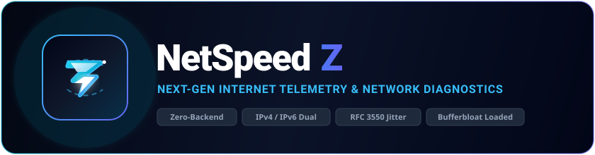

<div align="center">

  <a href="https://net-speedz.vercel.app/" target="_blank" rel="noopener noreferrer">
    
  </a>

  <br /><br />

  [](https://net-speedz.vercel.app/)
  [](https://net-speedz.vercel.app/)
  [](https://net-speedz.vercel.app/)
  [](https://www.typescriptlang.org/)
  [](https://react.dev/)
  [](https://vitejs.dev/)
  [](https://tailwindcss.com/)
  [](LICENSE)
  [](https://net-speedz.vercel.app/)
  [](CONTRIBUTING.md)

  <br /><br />

  **[ 🌐 Trải nghiệm Trực tiếp ](https://net-speedz.vercel.app/)** &nbsp;&bull;&nbsp; **[ 📖 Tài liệu Kỹ thuật ](#-kiến-trúc-kỹ-thuật)** &nbsp;&bull;&nbsp; **[ 🚀 Triển khai 1-Click ](#-triển-khai-nhanh-1-click-deployment)** &nbsp;&bull;&nbsp; **[ 🐛 Báo cáo Lỗi ](https://github.com/RINz-HCMUS/NetSpeedZ/issues)** &nbsp;&bull;&nbsp; **[ 💡 Đề xuất Tính năng ](https://github.com/RINz-HCMUS/NetSpeedZ/issues)**

</div>

---

## 📑 Mục lục

- [Tổng quan](#-tổng-quan)
- [Bảng so sánh tính năng](#-bảng-so-sánh-tính-năng)
- [Kiến trúc kỹ thuật](#-kiến-trúc-kỹ-thuật)
- [Phương pháp đo đạc & Thuật toán](#-phương-pháp-đo-đạc--thuật-toán)
- [Hệ thống đánh giá & Phân hạng (NQS)](#-hệ-thống-đánh-giá--phân-hạng-nqs)
- [Mô hình bảo mật & Quyền riêng tư](#-mô-hình-bảo-mật--quyền-riêng-tư)
- [Cấu trúc thư mục dự án](#-cấu-trúc-thư-mục-dự-án)
- [Cài đặt & Vận hành cục bộ](#-cài-đặt--vận-hành-cục-bộ)
- [Triển khai nhanh (1-Click Deployment)](#-triển-khai-nhanh-1-click-deployment)
- [Khả năng tương thích trình duyệt](#-khả-năng-tương-thích-trình-duyệt)
- [Quy chuẩn đóng góp (Contributing)](#-quy-chuẩn-đóng-góp-contributing)
- [Giấy phép (License)](#-giấy-phép-license)

---

## 🌟 Tổng quan

**NetSpeedZ** là công cụ kiểm tra chất lượng kết nối Internet độc lập, hiệu năng cao, được thiết kế nhằm cung cấp các chỉ số đo đạc chính xác, khách quan và tức thời về đường truyền người dùng.

Khác với các giải pháp truyền thống phụ thuộc vào cụm máy chủ ủy quyền trung gian (reverse proxy) hoặc hạ tầng đo kiểm tập trung thu thập dữ liệu người dùng, NetSpeedZ thiết lập kết nối trực tiếp từ trình duyệt (*Client-Side Direct*) tới các điểm hiện diện mạng (*Anycast Edge PoPs*) phân tán toàn cầu.

### Tính năng nổi bật

- ⚡ **Zero-Backend Architecture:** Toàn bộ thuật toán đo, tính toán phân vị và dựng biểu đồ telemetry diễn ra 100% trong luồng trình duyệt.
- 🚀 **Multi-Stream Ingestion:** Tận dụng tối đa băng thông đường truyền bằng cách khởi tạo đồng thời từ 4 đến 8 luồng kết nối TCP/HTTPS độc lập.
- 🌐 **Nhận diện Dual-Stack IPv4 / IPv6:** Tự động phát hiện trạng thái địa chỉ IP, số hiệu Hệ thống tự trị (ASN), tổ chức mạng và vị trí địa lý.
- 📉 **Chẩn đoán Bufferbloat (Loaded Latency):** Đo lường sự gia tăng độ trễ dưới điều kiện nghẽn băng thông để phát hiện hiện tượng tràn bộ đệm tại router.
- 🛡️ **Zero Tracking & Data Privacy:** Không sử dụng cookies đăng nhập, không thu thập nhật ký truy cập, toàn quyền quản lý dữ liệu lưu trữ cục bộ.

---

## 📊 Bảng so sánh tính năng

| Tiêu chí kỹ thuật | NetSpeedZ | Ookla Speedtest | Fast.com (Netflix) | Google M-Lab |
| :--- | :---: | :---: | :---: | :---: |
| **Kiến trúc vận hành** | **Client-Side Direct (Zero-Server)** | Proxy Server tập trung | CDN Edge | Web100 Server |
| **Hỗ trợ Dual-Stack IPv4/IPv6** | **Tự động nhận diện cả 2** | Chỉ 1 giao thức tại 1 thời điểm | Có giới hạn | Có giới hạn |
| **Đo biến thiên Jitter (RFC 3550)** | **Có (Thuật toán viễn thông chuẩn)** | Đo cơ bản | Đo cơ bản | Đo cơ bản |
| **Phân tích Bufferbloat có tải** | **Đo liên tục Download & Upload** | Có (chỉ bản App) | Có | Có |
| **Quảng cáo & Theo dõi (Tracking)** | **100% Không quảng cáo / No Ads** | Quảng cáo dày đặc | Không | Không |
| **Lưu trữ lịch sử & Xuất CSV/JSON** | **Cục bộ an toàn (LocalStorage)** | Bắt buộc tạo tài khoản | Không hỗ trợ | Không hỗ trợ |
| **Mã nguồn mở (Open Source)** | **MIT License** | Đóng mã nguồn | Đóng mã nguồn | Một phần |

---

## 🏗️ Kiến trúc kỹ thuật

Hệ thống hoạt động hoàn toàn phi tập trung với luồng dữ liệu một chiều:

```
[ Trình duyệt Client ] 
    │
    ├── 1. Xác định vị trí & Dual-Stack IP ───> [ Anycast IP & Geo API ]
    │
    ├── 2. Tuyển chọn trạm đo tối ưu ────────> [ Trạm Edge gần nhất / Tự chọn ]
    │
    ├── 3. Đo Ping tĩnh & Jitter (RFC 3550) ──> [ ICMP / HTTP Round-Trip Time ]
    │
    ├── 4. Đa luồng Download (Chunk Streaming) > [ CDN Edge PoPs (Cloudflare/Fastly) ]
    │
    ├── 5. Đa luồng Upload (Synthetic Payload) > [ Edge HTTP Ingestion Endpoints ]
    │
    └── 6. Phân tích thống kê & Lưu trữ ─────> [ Client LocalStorage / IndexedDB ]
```

---

## 📐 Phương pháp đo đạc & Thuật toán

### 1. Độ trễ (Ping / Round-Trip Time) & Jitter

- **Độ trễ tĩnh (Idle Latency):** Thực hiện đo RTT liên tục qua chuỗi request HTTP HEAD/GET tới điểm đo gần nhất, áp dụng thuật toán cắt tỉa ngoại lai 15% (Outlier Trimming) để triệt tiêu biến động bất thường.
- **Biến thiên độ trễ (Jitter):** Tính toán theo công thức chuẩn viễn thông quốc tế **RFC 3550**:

$$\text{Jitter}_i = \text{Jitter}_{i-1} + \frac{|\Delta \text{Delay}_i| - \text{Jitter}_{i-1}}{16}$$

- **Độ trễ khi có tải (Loaded Latency / Bufferbloat):** Đo đạc song song RTT trong khi luồng Download/Upload đang chiếm dụng tối đa băng thông nhằm định lượng mức suy hao chất lượng mạng khi quá tải.

### 2. Tốc độ Tải xuống (Download Throughput)

- Khởi tạo đồng thời nhiều kết nối HTTP/2 song song tới các khối tệp nhị phân không thể nén (random uncompressible byte streams) có kích thước tăng dần từ 1 MB đến 50 MB.
- Tính toán thông lượng tức thời thông qua hàm trọng số trượt (Sliding Window Exponential Moving Average):

$$\text{Throughput} = \frac{\sum \Delta \text{Bytes} \times 8}{\Delta t \times 10^6} \quad (\text{Mbps})$$

### 3. Tốc độ Tải lên (Upload Throughput)

- Tạo mảng dữ liệu ngẫu nhiên dạng `Uint8Array` / `Blob` với kích thước tương thích kích thước MTU mạng.
- Gửi dữ liệu đa luồng qua phương thức HTTP POST, giám sát tiến trình byte đã ghi qua sự kiện `xhr.upload.onprogress` và `Fetch Streams`.

---

## 🎯 Hệ thống đánh giá & Phân hạng (NQS)

NetSpeedZ tính toán điểm chất lượng tổng thể (**Network Quality Score - NQS**) trên thang điểm 100 dựa trên mô hình ma trận trọng số 4 tác vụ thực tế:

| Tác vụ | Trọng số | Tiêu chí trọng yếu | Yêu cầu định mức tối ưu |
| :--- | :---: | :--- | :--- |
| **Streaming Media** | 30% | Băng thông Download, độ ổn định luồng | &ge; 40 Mbps, Packet Loss &sim; 0% |
| **Online Gaming** | 25% | Độ trễ (Ping), Biến thiên (Jitter), Bufferbloat | Ping &lt; 30 ms, Jitter &lt; 5 ms |
| **Video Call / RTC** | 25% | Băng thông 2 chiều đối xứng, Ping, Jitter | Ping &lt; 50 ms, Upload &ge; 10 Mbps |
| **File Transfer** | 20% | Thông lượng Download và Upload thuần | Download & Upload cân bằng, tải nặng |

### Thang phân hạng tổng quan

- **A+ (&ge; 92 điểm):** Đường truyền đạt mức xuất sắc vượt trội. Tối ưu cho thi đấu eSports, truyền phát nội dung số chất lượng cao và tải đa luồng cường độ lớn.
- **A (80 – 91 điểm):** Kết nối rất tốt. Vận hành mượt mà mọi tác vụ thông thường, phát video 4K/8K không gián đoạn.
- **B (68 – 79 điểm):** Kết nối tốt. Đảm bảo độ ổn định cao cho công việc từ xa, hội nghị truyền hình đa điểm và giải trí trực tuyến.
- **C (50 – 67 điểm):** Kết nối trung bình. Đạt chuẩn cho nhu cầu duyệt web cơ bản và phát trực tiếp Full HD; có thể xuất hiện độ trễ khi có tải nặng.
- **D (&lt; 50 điểm):** Kết nối chất lượng kém. Băng thông hạn chế hoặc tình trạng suy giảm gói tin cao, khuyến nghị kiểm tra lại thiết bị hoặc nhà mạng.

---

## 🔒 Mô hình bảo mật & Quyền riêng tư

1. **Zero Logging & No Telemetry Collection:** Không ghi nhận hay gửi bất kỳ dữ liệu cá nhân, lịch sử duyệt web hoặc kết quả đo về máy chủ trung tâm.
2. **Không Cookies, Không Token:** Loại trừ hoàn toàn nguy cơ chiếm đoạt phiên đăng nhập (Session Hijacking) hoặc CSRF.
3. **Bộ nhớ cục bộ an toàn:** Toàn bộ lịch sử đo được lưu trữ độc quyền trong `LocalStorage` của trình duyệt người dùng; hỗ trợ xóa dữ liệu và xuất báo cáo CSV/JSON trực tiếp.
4. **HTTPS / TLS 1.3:** Toàn bộ tiến trình truyền nhận mẫu thử nghiệm được mã hóa hoàn toàn theo tiêu chuẩn mã hóa giao vận cao nhất.

---

## 📁 Cấu trúc thư mục dự án

```text
NetSpeedZ/
├── src/
│   ├── components/                 # Các module thành phần giao diện
│   │   ├── ZLightningLogo.tsx      # Biểu tượng thương hiệu animated Z-Lightning
│   │   ├── SpeedGauge.tsx          # Đồng hồ đo tốc độ thời gian thực (Canvas API)
│   │   ├── TelemetryMetrics.tsx    # Bảng chỉ số chi tiết (Ping, Jitter, Bufferbloat)
│   │   ├── NetworkInfoCard.tsx     # Thẻ định danh địa chỉ IP, ASN, ISP & Vị trí
│   │   ├── PerformanceRatings.tsx  # Ma trận đánh giá NQS theo từng tác vụ
│   │   ├── HistoryTable.tsx        # Bảng lịch sử đo & Bộ lọc phân tích
│   │   ├── ServerSelectorModal.tsx # Hộp thoại tuyển chọn trạm đo Anycast
│   │   ├── SecurityShieldModal.tsx # Hộp thoại thông số chuẩn bảo mật 6 lớp
│   │   └── InfoModal.tsx           # Hướng dẫn kỹ thuật và giải thích chỉ số
│   ├── types.ts                    # Định nghĩa cấu trúc dữ liệu TypeScript
│   ├── App.tsx                     # Bộ điều khiển trung tâm & luồng đo đạc
│   ├── main.tsx                    # Điểm khởi tạo ứng dụng React
│   └── index.css                   # Định kiểu toàn cục & Tailwind CSS
├── public/                         # Tài nguyên tĩnh & Icons
├── index.html                      # Tệp HTML entry point & Cấu hình SEO
├── package.json                    # Khai báo phụ thuộc và scripts
├── tsconfig.json                   # Cấu hình kiểm tra kiểu TypeScript
└── vite.config.ts                  # Cấu hình bộ đóng gói Vite
```

---

## 💻 Cài đặt & Vận hành cục bộ

### Yêu cầu môi trường
- **Node.js:** Phiên bản `>= 18.0.0`
- **npm** `>= 9.0.0` (hoặc `pnpm` / `yarn`)

### Các bước cài đặt

```bash
# 1. Sao chép kho mã nguồn
git clone https://github.com/RINz-HCMUS/NetSpeedZ.git
cd NetSpeedZ

# 2. Cài đặt các gói phụ thuộc
npm install

# 3. Khởi chạy môi trường phát triển (Hot-Reload)
npm run dev

# 4. Kiểm tra lỗi cú pháp và chuẩn kiểu dữ liệu
npm run lint

# 5. Đóng gói cho môi trường vận hành (Production Build)
npm run build
```

Sau khi biên dịch, gói phân phối tối ưu hóa sẽ được tạo tại thư mục `dist/`.

---

## 🚀 Triển khai nhanh (1-Click Deployment)

> ⚡ **Bản dựng chính thức đang hoạt động tại:** [https://net-speedz.vercel.app/](https://net-speedz.vercel.app/)

Vì NetSpeedZ được xây dựng dưới dạng **Single Page Application (SPA)** tĩnh, bạn có thể triển khai miễn phí vĩnh viễn với CDN toàn cầu qua các nền tảng sau:

### Nền tảng Đám mây (Cloud Providers)

[](https://vercel.com/new/clone?repository-url=https%3A%2F%2Fgithub.com%2FRINz-HCMUS%2FNetSpeedZ)
&nbsp;
[](https://app.netlify.com/start/deploy?repository=https://github.com/RINz-HCMUS/NetSpeedZ)
&nbsp;
[](https://dash.cloudflare.com/)

### Cấu hình máy chủ Web Nginx (Self-Hosted)

Nếu vận hành trên máy chủ riêng (VPS / Dedicated Server), sử dụng cấu hình Nginx sau để đảm bảo hỗ trợ định tuyến SPA:

```nginx
server {
    listen 80;
    listen [::]:80;
    server_name netspeedz.yourdomain.com;

    root /var/www/netspeedz/dist;
    index index.html;

    # Hỗ trợ định tuyến SPA
    location / {
        try_files $uri $uri/ /index.html;
    }

    # Bật nén Gzip tối ưu hóa hiệu năng tải tệp
    gzip on;
    gzip_vary on;
    gzip_min_length 1024;
    gzip_proxied expired no-cache no-store private auth;
    gzip_types text/plain text/css application/json application/javascript text/xml application/xml application/xml+rss text/javascript;

    # Cấu hình Cache-Control cho tài nguyên tĩnh
    location ~* \.(js|css|png|jpg|jpeg|gif|svg|ico|woff|woff2)$ {
        expires 1y;
        add_header Cache-Control "public, no-transform";
    }
}
```

---

## 🌐 Khả năng tương thích trình duyệt

Dự án hỗ trợ đầy đủ tất cả các trình duyệt hiện đại hỗ trợ tiêu chuẩn ECMAScript 2020+, Web Streams API và Fetch API:

| Trình duyệt | Phiên bản hỗ trợ | Trạng thái |
| :--- | :---: | :---: |
| **Google Chrome** | &ge; 90 |  |
| **Mozilla Firefox** | &ge; 88 |  |
| **Apple Safari** | &ge; 14 |  |
| **Microsoft Edge** | &ge; 90 |  |
| **Trình duyệt di động (iOS / Android)** | Mọi bản cập nhật |  |

---

## 🤝 Quy chuẩn đóng góp (Contributing)

Mọi đóng góp nhằm cải thiện NetSpeedZ đều được hoan nghênh. Vui lòng tuân thủ quy trình sau:

1. **Fork** kho mã nguồn về tài khoản cá nhân.
2. Tạo nhánh tính năng mới: `git checkout -b feature/AmazingFeature`
3. Thực hiện commit theo quy chuẩn [Conventional Commits](https://www.conventionalcommits.org/):
   ```bash
   git commit -m "feat(engine): optimize sliding window throughput calculations"
   ```
4. Đẩy nhánh lên remote: `git push origin feature/AmazingFeature`
5. Khởi tạo một **Pull Request** kèm theo mô tả chi tiết các thay đổi.

---

## 📄 Giấy phép (License)

Dự án được phân phối dưới giấy phép **MIT License**. Bạn được tự do sử dụng, chỉnh sửa, phân phối và tích hợp vào các dự án thương mại hoặc cá nhân. Chi tiết vui lòng xem tệp [LICENSE](LICENSE).

<div align="center">
  <sub>Được phát triển với niềm đam mê dành cho cộng đồng mạng máy tính và mã nguồn mở.</sub>
</div>
